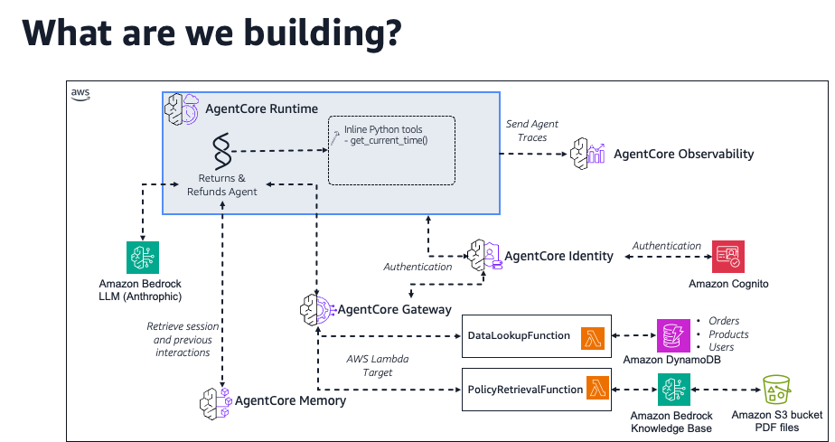
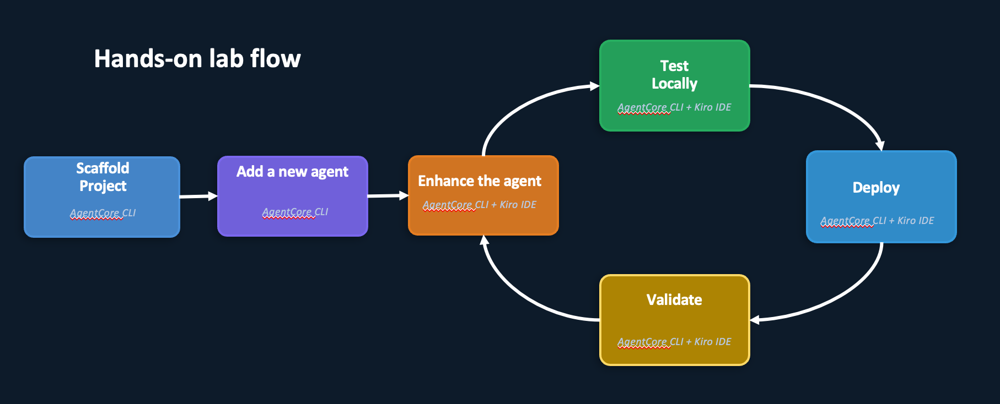

## Returns & Refunds Agent Workshop

In this lab, you'll build a production-ready returns and refunds assistant using the
AgentCore CLI and Kiro IDE. The AgentCore CLI handles all infrastructure operations:
scaffolding, testing, deploying, and managing your agent, while Kiro helps you write
the agent code, Lambda functions, and UI.

**Why AgentCore?** Building AI agents is the easy part; operating them in production
is where it gets hard. You'd normally need to handle auto-scaling, IAM roles, secure
API access, memory persistence, and observability yourself. AgentCore takes care of
all of that so you can focus on the agent's logic, not the infrastructure underneath it.

## What We're Building

**The Scenario:** You work at an e-commerce company that needs to automate its
customer returns and refunds workflow. Today, support agents manually look up orders,
check return eligibility windows, calculate refund amounts, and reference
country-specific return policies. This is a slow and error-prone process. Your goal is to
build an AI-powered assistant that handles all of this through natural conversation.

The Returns & Refunds Agent can:

- Look up customer orders, products, and account details from DynamoDB
- Check whether an item is still within its return eligibility window
- Calculate the correct refund amount based on product condition and return reason
- Retrieve and apply the right return policy (US, UK, or India) from a Knowledge Base
- Remember customer preferences (e.g., preferred refund method) across sessions

By the end of this lab, you'll have deployed this agent as a fully working agentic
chatbot with:

- A Strands agent deployed on AgentCore Runtime that handles returns and refunds
- Persistent memory that recalls customer preferences across conversations
- A gateway connecting to DynamoDB (order/customer/product data) and a Knowledge Base
  (return policies)
- A Streamlit web UI with Cognito authentication
- Full observability through CloudWatch logs, traces, and the GenAI dashboard
- Quality evaluation with continuous monitoring, custom evaluators, and regression
  testing

### Target Architecture

## How You'll Get There

You'll build this architecture incrementally across 10 parts, starting with a basic
agent and layering on memory, data access, a web UI, observability, quality
evaluation, and fine-grained authorization one step at a time. Each part builds on the
previous one, so follow them in order.

### Lab flow

## How This Workshop Works

### CLI-First, Kiro-Assisted

This workshop uses two tools with clearly separated responsibilities:

- **AgentCore CLI (`@aws/agentcore`)**: scaffold projects, test locally, deploy to
  production, add memory and gateway resources, stream logs, and view traces. You'll
  run these commands in your terminal.
- **Kiro IDE**: modify agent code, add tool functions, create Lambda functions, query
  DynamoDB tables, and build the Streamlit UI. You'll paste prompts into Kiro and
  review the generated code.

Every step tells you which tool to use. CLI commands appear in shell code blocks. Kiro
prompts are labeled with 🤖 and have their own copy blocks.

## What You'll Build

By the end of this lab, you'll have:

- A Strands agent deployed to AgentCore Runtime with auto-scaling
- Custom `@tool` functions for return eligibility and refund calculations
- Persistent memory that recalls customer preferences across sessions
- A gateway connecting to DynamoDB tables (order data) and a Knowledge Base (return
  policies)
- A Streamlit web UI with Cognito authentication
- Full observability with CloudWatch logs, traces, and the GenAI dashboard

## Workshop Structure

This lab follows a numbered progression with a final cleanup section. Complete the
parts in order, then remove all resources at the end.

### Part 1: Your First Agent in 3 Commands (~20 min)

Scaffold a new Strands agent project with `agentcore create`, test it locally with
`agentcore dev`, deploy to AgentCore Runtime with `agentcore deploy`, and invoke it in
the cloud with `agentcore invoke`. This part is pure CLI. No Kiro prompts.

### Part 2: Build the Returns & Refunds Agent (~25 min)

Use Kiro to add a domain-specific system prompt and `@tool` decorated functions for
order lookup, customer lookup, product lookup, and policy retrieval (mock data). Then
use the CLI to test and redeploy.

### Part 3: Add Persistent Memory for Cross-Session Recall (~25 min)

Run `agentcore add memory` to create a memory resource, then use Kiro to integrate the
memory session manager into your agent code. Seed memory with customer preferences and
test recall across sessions.

### Part 4: Connect to Real Data - DynamoDB & Knowledge Base (~35 min)

Use Kiro to explore pre-created DynamoDB tables data, create Lambda functions for
order lookups and policy retrieval, and generate tool specs. Then use the CLI to add
gateway targets and test the integrated agent.

### Part 5: Build a Web Chat UI with Streamlit and Cognito (~25 min)

Use Kiro to create a Cognito User Pool and a Streamlit chat application. Run the UI
locally and test the full end-to-end workflow through the browser.

### Part 6: Explore Observability - Logs, Traces & GenAI Dashboard (~10 min)

Stream CloudWatch logs with `agentcore logs`, view execution traces with
`agentcore traces`, and explore the GenAI Observability dashboard in the AWS Console.

### Part 7: Make It Yours - Open-Ended Enhancements (~open-ended)

### Part 8: Try the AgentCore Harness (Preview) (~15 min)

Add a `CustAssistantHarness` to the same project and compare the config-first managed
harness with the code-first runtime agent you've been building. Try built-in browser
tools and per-invocation overrides without redeploying.

### Part 9: Evaluate Agent Quality with AgentCore Evaluations (~30 min)

Set up on-demand, online, and batch evaluations to measure agent quality across five
axes: task success, faithfulness, safety, tooling behavior, and cost/latency. Create a
custom domain-specific evaluator, build a golden dataset with expected tool
trajectories, and configure continuous monitoring with CloudWatch alarms.

### Part 10: Secure Tool Access with AgentCore Policies (~30 min)

Attach a Cedar policy engine to the existing gateway and write fine-grained
authorization rules that control which tools users can call, with what parameters, and
under what conditions. Start in `LOG_ONLY` mode, add RBAC via Cognito JWT claims,
switch to `ENFORCE`, add time-based and emergency forbid rules, and finish with a
Lambda interceptor that enriches request context for policy decisions.

### Clean Up (~5 min)

Remove all AgentCore resources (runtime agent, harness, memory, gateway) and
supporting resources (Lambda functions, Cognito User Pool, IAM roles) to avoid ongoing
charges.

## Key Technologies

| Technology | Role |
|---|---|
| AgentCore CLI (`@aws/agentcore`) | Project scaffolding, local testing, deployment, resource management |
| Strands Agents SDK | Lightweight Python framework for building AI agents with `@tool` decorators |
| Amazon Bedrock AgentCore Runtime | Serverless production environment with auto-scaling |
| Amazon Bedrock AgentCore Memory | Persistent memory with three strategies: summary, preferences, semantic |
| Amazon Bedrock AgentCore Gateway | Secure bridge exposing Lambda functions as MCP tools via IAM auth |
| Amazon Bedrock AgentCore Evaluations | LLM-as-a-Judge quality scoring with built-in and custom evaluators |
| Amazon Bedrock AgentCore Policy | Cedar-based fine-grained authorization at the gateway boundary |
| Amazon DynamoDB | Pre-created tables with order, customer, and product data from CSV seed files |
| Amazon Bedrock Knowledge Base | Pre-created KB with Amazon return policy documents (US, UK, India) |
| Streamlit | Python web UI framework for the chat interface |
| Amazon Cognito | OAuth authentication for the Streamlit UI |
| Kiro IDE | AI-powered IDE for code modifications and resource creation |

## Prerequisites

Before starting, ensure you have:

- Completed Lab 1: Kiro IDE installed and configured on your EC2 instance
- AWS Account: With permissions for Bedrock, Cognito, Lambda, IAM, and CloudWatch
- Pre-configured EC2 environment with the following pre-installed:
  - Node.js 20+
  - Python 3.12+
  - AWS CDK
  - AgentCore CLI (`@aws/agentcore`)
  - Docker
  - Kiro IDE

> If you're at an AWS-hosted event, your EC2 instance already has everything
> installed. Just make sure Lab 1 is complete and your Kiro IDE is connected.

## What You'll Learn

By completing this lab, you will:

- ✅ Use the AgentCore CLI to scaffold, test, deploy, and manage AI agents
- ✅ Use Kiro to modify agent code, create tools, and build supporting resources
- ✅ Create custom `@tool` functions with the Strands Agents SDK
- ✅ Add persistent memory for context-aware interactions
- ✅ Connect agents to external data via gateways, DynamoDB tables, and Knowledge
  Bases
- ✅ Build a Streamlit UI with Cognito authentication
- ✅ Monitor production agents with CloudWatch logs, traces, and dashboards
- ✅ Evaluate agent quality with on-demand, online, and batch evaluations using
  built-in and custom evaluators
- ✅ Secure tool access with Cedar policies (parameter constraints, RBAC, time-based
  rules) and Lambda interceptors

## Getting Started

Click **Part 1: Create and Deploy Basic Agent** to begin. Each part builds on the
previous one, so follow them in order.
